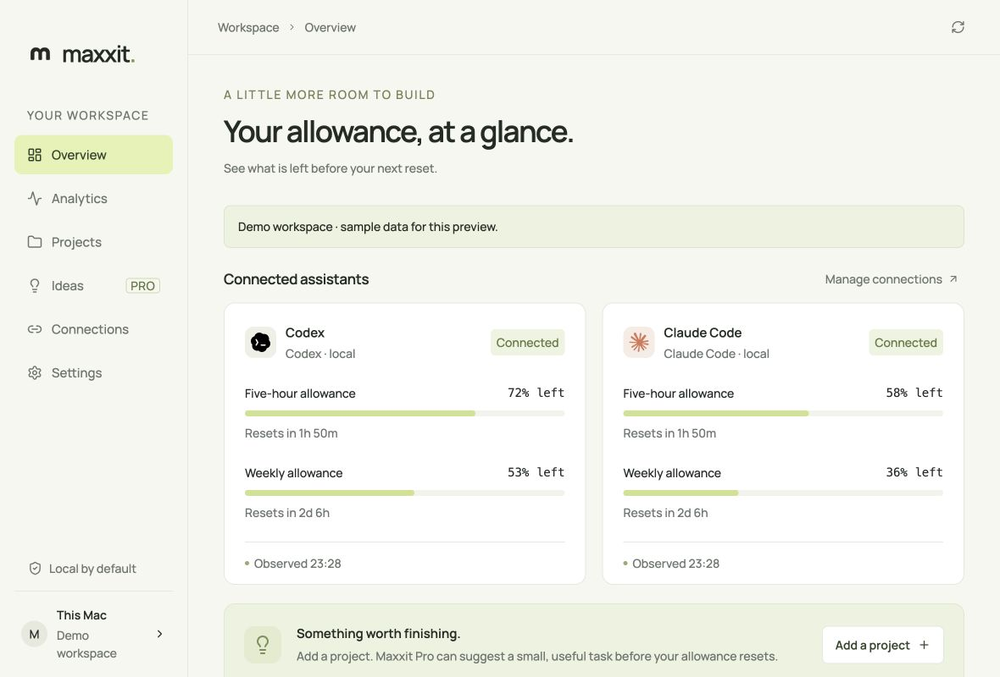
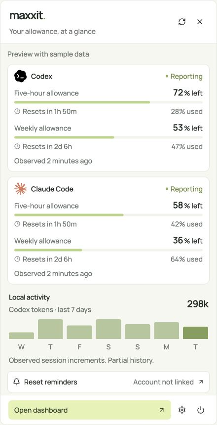
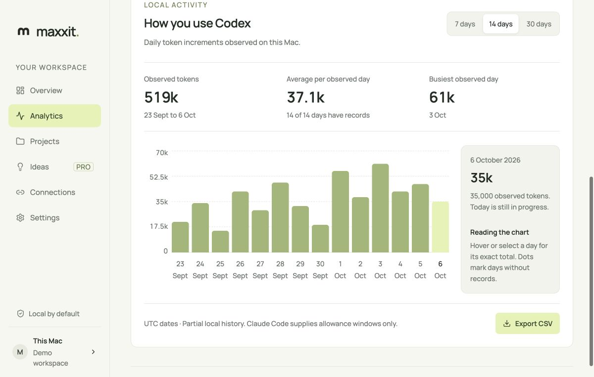

# Maxxit

Track Codex and Claude Code usage and reset times on your Mac. The app includes daily Codex token charts, a menu bar usage panel, and a project list.

Built with Tauri 2, React, and Rust. Local analytics are free and work without a Maxxit account. Maxxit Pro adds project ideas and reset emails for $9.99/month after service setup is complete.



## Installation

macOS 14 or later, Apple silicon or Intel.

Get the app from [maxxit.app/download](https://maxxit.app/download). Open the DMG, drag Maxxit into Applications, then launch it from Applications. The download button becomes available when a stable Mac installer is published.

Maxxit checks for updates on launch and hourly while the window is visible. When a newer release is available, an update button appears above your workspace. Download and install it there, then restart when you're ready. You can also check manually in Settings. Updates use Tauri's signature verification.

For contributors who want to build the preview locally, [the optional installer](scripts/install.sh) remains available. It needs Homebrew and Apple's command-line tools while a signed release is pending.

## Connect your assistants

1. Sign in through the official CLI: `codex login` or `claude`.
2. Open **Connections** in Maxxit.
3. Select **Connect local usage** for the provider you use. Claude shows the proposed status-line change before applying it; existing output is preserved.
4. Use the assistant. Maxxit refreshes once a minute, including while its window is closed.


Click the menu bar icon for a compact usage panel. It shows every reported allowance window, reset countdowns, freshness, observed Codex token activity, and reset reminder status. Hover over a reset or chart bar for its exact time or token count. Click outside or press Escape to close the panel. You can also open it from View > Show usage panel with Cmd+Shift+U. Right-click the icon for the basic Open, Refresh, and Quit menu.



These screenshots show the actual interface with labeled sample data. Direct third-party provider OAuth is not available. Maxxit does not read provider token files, browser sessions, or passwords. Codex usage comes from local session records; Claude allowance comes from its documented status line. Claude may omit allowance until its next API response.

Missing, expired, or observations older than two hours are shown as unavailable. Token charts contain observed local session increments and are explicitly partial. Percentages describe allowance windows, not billing credits or the cost of a task.

## Usage analytics

Choose 7, 14, or 30 days in Analytics. The chart shows a continuous UTC timeline with a token scale, period total, average per observed day, and busiest observed day. Select a bar with the mouse or keyboard for its exact total. Dots mark dates without records, which are excluded from the average. Today is still in progress. Export CSV saves the selected period with blank totals for unknown dates.



## Optional cloud features

Connect a Maxxit account in **Connections**, approve the one-time code in the website, and choose usage and project sharing separately. The device credential stays in Mac Keychain. Usage sync sends allowance fields; project sharing sends only the descriptions you write. Conversation content, full paths, and provider credentials are excluded.

Pro checkout opens Polar in your browser. After paying, enable project sharing for ideas and verify your email in website settings for reset emails. Billing and email remain unavailable until the owner supplies credentials. Ideas never run automatically.

## Development

Use Node.js 24, pnpm 10.19.0, Rust, and Apple's command-line developer tools.

```sh
corepack enable
pnpm install --frozen-lockfile
pnpm desktop:dev
pnpm build
pnpm test
pnpm native:test
pnpm tauri build --config '{"bundle":{"createUpdaterArtifacts":false}}'
```

Use `pnpm dev` and open `http://127.0.0.1:1420/?demo` for the isolated browser preview. Demo data is never loaded in the native app.

## Uninstall

Disconnect Claude first to restore its previous status-line command. Disconnect your Maxxit account to revoke the device credential. Quit from the menu bar, then move `~/Applications/Maxxit.app` to Trash. Local data is in `~/Library/Application Support/app.maxxit.desktop`; delete that folder only if you want to remove local preferences, projects, and observations.

## Security and trademarks

Report vulnerabilities privately to contact@maxxit.app. See [SECURITY.md](SECURITY.md). [MIT license](LICENSE) applies to Maxxit code. Provider names and marks belong to their owners and do not imply endorsement; [asset attribution](public/providers/ATTRIBUTION.md). Manrope is licensed under the included SIL Open Font License.

## Release updates

Production builds enable `bundle.createUpdaterArtifacts`. Set `TAURI_SIGNING_PRIVATE_KEY` and `TAURI_SIGNING_PRIVATE_KEY_PASSWORD` in the build environment, along with the Apple signing and notarization credentials. Keep the private updater key outside this repository. The public key in `src-tauri/tauri.conf.json` must match it.

Build a signed, notarized universal app with `pnpm tauri build --target universal-apple-darwin`. Use `scripts/release.sh VERSION APP_PATH DMG_PATH` with `TAURI_SIGNING_PRIVATE_KEY_PATH` to prepare a GitHub draft. The script checks Apple's signature and notarization, verifies both architectures, signs the updater archive, and attaches `latest.json`, the universal DMG, and checksums.

Set the same version in `package.json`, `src-tauri/Cargo.toml`, and `src-tauri/tauri.conf.json` before building. Test the DMG on both architectures and the update from a previous installed version, then publish the draft as a stable release. Draft and prerelease assets do not appear on the website. The website checks GitHub's public latest release and caches it for five minutes. Its installer expects the asset name `Maxxit-universal.dmg`; the updater expects `latest.json` with `darwin-aarch64` and `darwin-x86_64` entries.
