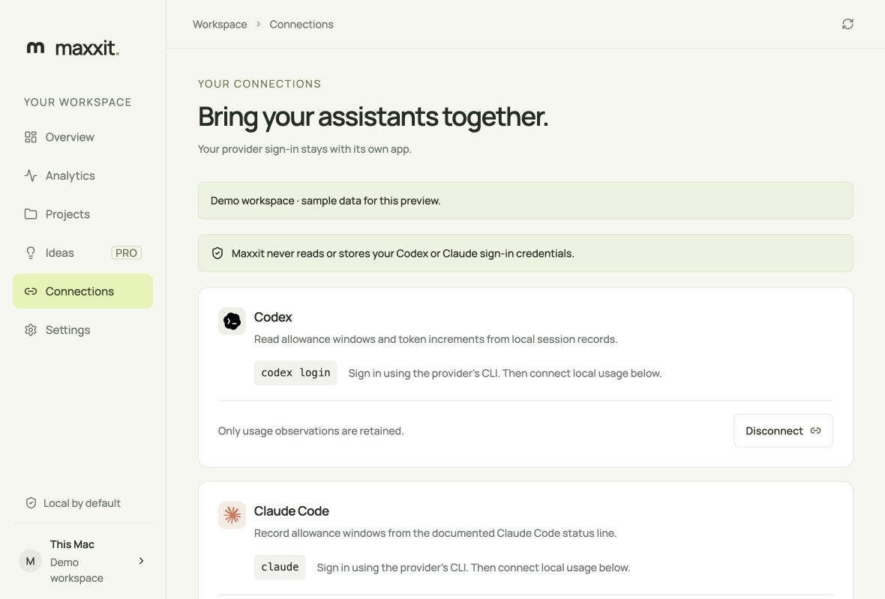

# Install Maxxit on macOS

Maxxit supports macOS 14 or later on Apple silicon and Intel. Download the current
stable Maxxit-universal.dmg from https://maxxit.app/download or GitHub Releases.

1. Open the DMG, drag Maxxit to Applications, and eject the mounted disk.
2. Launch Maxxit from /Applications. Keep macOS security protection enabled.
3. Sign in or create a free Maxxit account in your browser and approve this Mac. Choose the data to mirror on the web.
4. Sign in through the official Codex or Claude CLI, then open Connections.
5. Select Connect local usage. For Claude, review and approve the status-line
   change before applying it. Use the assistant to produce a fresh allowance reading.



The existing screenshots show the app with labeled sample data. Download and DMG
screenshots are still a release acceptance task and must come from the real installer.

A Maxxit account is required. Local analytics remain free, and verified accounts can use local features offline for seven days. Usage, projects, preferences, and detailed workflows have separate optional web sharing scopes. Review privacy.md before enabling sharing. Hosted
billing/email availability is determined by the service; ideas never run automatically.

## Other install paths

The verified installer script downloads the DMG, checks its checksum and the
app's Maxxit signing identity, and installs under ~/Applications. Inspect scripts/install.sh
before running it. The script requires Apple command-line tools for signature and
notarization verification; the normal DMG installation does not. A failed download returns an error; it never builds source automatically.

The Homebrew tap uses the released universal DMG. Once the cask change is integrated:

```sh
brew install --cask maxxit-app/tap/maxxit
```

Contributors can build explicitly using CONTRIBUTING.md. Unsigned source builds
are development artifacts and are not the normal consumer installation.

## Updates and checksums

Maxxit checks on launch and hourly while its main window is visible. Settings
also has a manual check. Install the offered update, then restart when ready.
The Tauri updater verifies the archive's signature.

Versions through 0.1.9 require the DMG installer once to gain update support.
Release checksums are in SHA256SUMS. A checksum verifies bytes; Apple's signature
and Tauri's updater signature establish the separate trust checks.

## Disconnect and uninstall

Disconnect Claude first to restore its previous status line when safe. Disconnect
the Maxxit account to lock local access and queue credential revocation for the next connection.
Quit from the menu bar. Remove the app from /Applications for DMG/Homebrew installs,
or ~/Applications for the script.

Data remains in ~/Library/Application Support/app.maxxit.desktop. Remove that
folder only if you want to erase preferences, projects, and observations.
Removing the app does not itself delete cloud records or the hosted account.
The cask has no data-erasure hook; Homebrew uninstall retains user data.

## Troubleshooting

For missing allowance, use the provider and check its CLI version; an old reset
does not imply a newly renewed window. For Keychain access errors, retry after
unlocking the Mac; do not erase the existing item blindly. For a failed update,
retry or use the current stable DMG. Never disable Gatekeeper or remove quarantine
to work around an invalid consumer release.

For a bridge restoration error, Claude settings or their location changed.
Review the previous and installed commands manually before editing.
Follow diagnostics.md for safe evidence and SUPPORT.md for routing.
